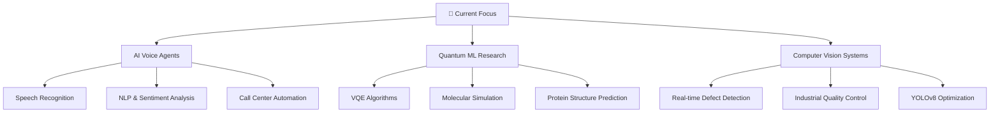

# Hi there! 👋 I'm Debraj

  

## 🚀 About Me

> *"Building the future, one AI product at a time"*

I'm a **tech-driven builder**, **problem-solver**, and **startup enthusiast** specializing in AI-first products with a strong focus on speech interfaces, machine learning, and quantum computation. Currently pursuing B.Tech in Mechanical Engineering at **NIT Durgapur** (2023–2027).

### 🎯 What I Do
- 🤖 **AI Voice Agents** - Replacing call centers with intelligent conversational AI
- 📊 **ML Automation** - Building smart systems for business optimization
- 🔬 **Computer Vision** - Real-time defect detection and quality control
- ⚛️ **Quantum Computing** - Researching quantum algorithms for molecular simulation
- 🌐 **Full-Stack Development** - Creating end-to-end solutions

 

## 🏆 Featured Projects

### 🎤 AI Voice Agents for SMBs
**Replacing call centers with human-like conversational AI**
 

*Built human-like conversational agents that automate customer support and outbound sales calls with real-time sentiment analysis & comprehensive call logs*

---

### 🔧 [MIGWeld Defect Detection](https://github.com/debraj-m/MIGWeld_Defect_Detection)
**Real-time computer vision system for industrial quality control**
 

*Precision: ~90% | Recall: ~88% | mAP@0.5: ~92%*

---

### 📊 [Advista](https://github.com/debraj-m/Advista)
**AI-powered news sentiment analysis & marketing intelligence**
 

*Intelligent news analysis tool combining web scraping, sentiment analysis, and AI-powered keyword extraction*

---

### 🤖 [Sheet-Agent](https://github.com/debraj-m/Sheet-Agent)
**LLM-powered spreadsheet automation and reasoning**
 

*Generalist agent for complex spreadsheet manipulation through natural language commands*

---

### ⚛️ Quantum Computing Research
**Variational Quantum Algorithms for Molecular Simulation**
 

*Built and optimized VQE & QAOA circuits for protein structure prediction research*

## 🛠️ Tech Stack & Tools

### 🧠 AI & Machine Learning

### 🌐 Web Development

### ☁️ Cloud & DevOps

### ⚛️ Quantum Computing

## 🏅 Achievements & Recognition

| 🏆 Achievement | 🎯 Details | 📊 Impact |
|:---|:---|:---|
| **🧠 Flipkart Grid 6.0** | Pre-Nationalist (Top 79 All India) | National Level Recognition |
| **🧪 HP Power Lab** | Semi-Finalist (Top 180/130,000) | 99.86% Percentile |
| **🎯 B2B Conversion** | 86% client onboarding rate | @HungryFolksMedia |
| **🌍 Marketing Lead** | Hult Prize NIT Durgapur | Leadership Role |
| **🧪 ML Fiesta Hackathon** | Winner - Synergy'24 | Technical Excellence |

## 📊 GitHub Statistics

  
  

  

  

## 🌟 What I'm Currently Working On

- 🔬 **Research**: Advancing quantum algorithms for molecular simulation
- 🤖 **Product Development**: Scaling AI voice agents for enterprise clients
- 📚 **Learning**: Advanced reinforcement learning and transformer architectures
- 🌍 **Open Source**: Contributing to quantum computing and AI communities

## 🌐 Let's Connect!

---

### 💭 *"The future belongs to those who learn more skills and combine them in creative ways"* - Robert Greene

**⭐ From [debraj-m](https://github.com/debraj-m) | Building the future with AI 🤖**

