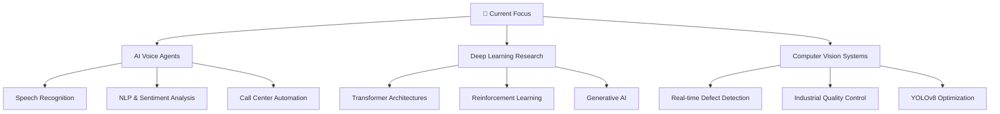

 

---

## 🚀 About Me

> *"Building the future, one AI product at a time"*

I'm a **tech-driven builder**, **problem-solver**, and **startup enthusiast** specializing in AI-first products with a strong focus on speech interfaces and machine learning. Currently pursuing B.Tech in Mechanical Engineering at **NIT Durgapur** (2023–2027).

### 🎯 What I Do
- 🤖 **AI Voice Agents** - Replacing call centers with intelligent conversational AI
- 📊 **ML Automation** - Building smart systems for business optimization
- 🔬 **Computer Vision** - Real-time defect detection and quality control
- 🧠 **Deep Learning** - Designing transformer architectures and neural networks
- 🌐 **Full-Stack Development** - Creating end-to-end solutions

 

## 🏆 Featured Projects

### 🎤 AI Voice Agents for SMBs
**Replacing call centers with human-like conversational AI**
 

*Built human-like conversational agents that automate customer support and outbound sales calls with real-time sentiment analysis & comprehensive call logs*

---

### 🔧 [MIGWeld Defect Detection](https://github.com/debraj-m/MIGWeld_Defect_Detection)
**Real-time computer vision system for industrial quality control**
 

*Precision: ~90% | Recall: ~88% | mAP@0.5: ~92%*

---

### 📊 [Advista](https://github.com/debraj-m/Advista)
**AI-powered news sentiment analysis & marketing intelligence**
 

*Intelligent news analysis tool combining web scraping, sentiment analysis, and AI-powered keyword extraction*

---

### 🤖 [Sheet-Agent](https://github.com/debraj-m/Sheet-Agent)
**LLM-powered spreadsheet automation and reasoning**
 

*Generalist agent for complex spreadsheet manipulation through natural language commands*

---

### 🧠 FlowBot
**Intelligent Workflow Automation powered by LLMs**
 

*Automates complex multi-step business workflows using LLM reasoning with tool-use and memory*

## 🛠️ Tech Stack & Tools

### 🧠 AI & Machine Learning

### 🌐 Web Development

### ☁️ Cloud & DevOps

## 🏅 Achievements & Recognition

| 🏆 Achievement | 🎯 Details | 📊 Impact |
|:---|:---|:---|
| **🧠 Flipkart Grid 6.0** | Pre-Nationalist (Top 79 All India) | National Level Recognition |
| **🧪 HP Power Lab** | Semi-Finalist (Top 180/130,000) | 99.86% Percentile |
| **🎯 B2B Conversion** | 86% client onboarding rate | @HungryFolksMedia |
| **🌍 Marketing Lead** | Hult Prize NIT Durgapur | Leadership Role |
| **🧪 ML Fiesta Hackathon** | Winner - Synergy'24 | Technical Excellence |

## 📊 GitHub Statistics

  
  

  

  

## 🏆 GitHub Trophies

  

## 🐍 Contribution Snake

  <picture>
    <source media="(prefers-color-scheme: dark)" srcset="https://raw.githubusercontent.com/debraj-m/debraj-m/output/github-contribution-grid-snake-dark.svg" />
    <source media="(prefers-color-scheme: light)" srcset="https://raw.githubusercontent.com/debraj-m/debraj-m/output/github-contribution-grid-snake.svg" />
    
  </picture>

## 🌟 What I'm Currently Working On

```mermaid
graph TD
    A[🚀 Current Focus] --> B[AI Voice Agents]
    A --> C[Deep Learning Research]
    A --> D[Computer Vision Systems]
    
    B --> B1[Speech Recognition]
    B --> B2[NLP & Sentiment Analysis]
    B --> B3[Call Center Automation]
    
    C --> C1[Transformer Architectures]
    C --> C2[Reinforcement Learning]
    C --> C3[Generative AI]
    
    D --> D1[Real-time Defect Detection]
    D --> D2[Industrial Quality Control]
    D --> D3[YOLOv8 Optimization]
```

- 🤖 **Product Development**: Scaling AI voice agents for enterprise clients
- 🧠 **Research**: Advancing deep learning and transformer architectures
- 📚 **Learning**: Advanced reinforcement learning and generative AI
- 🌍 **Open Source**: Contributing to AI and machine learning communities

## 🌐 Let's Connect!

---

### 💭 *"The future belongs to those who learn more skills and combine them in creative ways"* — Robert Greene

**⭐ From [debraj-m](https://github.com/debraj-m) | Building the future with AI 🤖**

